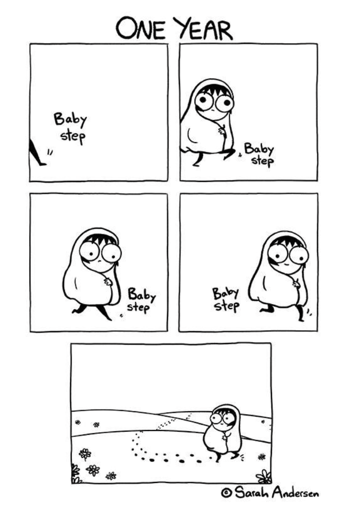

# <u>Final Review 6.009 Fundamentals of Programming</u>

## 刻意练习

刻意练习是在很多领域成为专家的有效方法，向有经验的人学习，动手练习，有经验的人的反馈。

仍然欠缺第三点：有经验的人的反馈——加入自学群，看有哪些资源。

# Lecture / Recitation

0. **基础**
   - 刻意练习
   - 复习：可变性mutability、数据类型、函数、环境、作用域scoping
1. **功能和调试**
   - 功能：作为一级对象first-class object、闭包closure、环境模型
   - 调试：程序内的小测试、函数内的调试打印
   - Comprehension：`zip`、list、matrix
2. **集合、字典**
   - immutable hashable objects
3. **图和图搜索**
   - 将搜索函数抽象化，以应对各种不同问题乃至不同的搜索算法
4. **递归、生成器、Doctest**
   - 递归适用于层层相似的结构，例如除去第一个元素的list还是一个list，除去root node的tree是若干个tree
   - while循环可以处理未知结构的问题，但是逻辑上不如递归优雅

7. **类**
   - 变量、属性和功能的继承及查找顺序
8. **类、面向对象**

# Lab

0. **基础**
   - 命令行
   - 程序设计、风格
   - 声音处理
1. **图像处理**
   - *抽象*：Kernel作为函数，被应用到大量滤镜中
2. **图像处理2**
   - *抽象*：边缘问题应该作为Helper Function进行抽象化
3. **Bacon Number：程序效率**
   - *预处理*：如果一个数据要被多次调用则处理为最易调用的数据类型
     - 针对不同需求对数据进行处理，乃至同一个数据源处理成不同数据结构存储在一个字典内
   - 避免反复遍历数据
   - 长列表避免使用 `L.pop()`
4. **Frugal Maps**
   - *抽象*：算法抽象，例如本例中的heuristic uniform-cost search
   - *准备*：在处理问题前先了解算法的基础知识，磨刀不误砍柴工
5. **Mines**
   - *抽象*：找到问题的难点，并将其抽象化，例如本例中的多维数据处理
   - *准备*：全面梳理问题的逻辑——初始状态的可能、输入的可能、状态变化的可能
   - *抽象*：过程中及最后的校订，将重复内容写为function、class、variable、loop等等
6. **SAT Solver**
   - *抽象*：尽量将复杂的函数拆解为小函数，除重复利用的可能性外，也便于测试和调试
7. **Autocomplete**
   - *准备*：先寻找资料了解数据类型的基础知识，磨刀不误砍柴工
   - *准备*：先分析各元素的数据类型和相互之间的关系及操作方式（绘制草图）
   - *抽象*：class（或function）中不同数据类型的输入和对应的处理方式有时可以通过一个helper function来解决

8. **Symbolic Algebra**
   - *抽象*：将不同的class抽象为super class，直到无法抽象为止，找出层级关系，最高层的class未必需要 `__init__`, 各子类可以共用属性和方法
   - *准备*：对于非直觉问题，写下简单例子是极好的方法
9. **LISP Interpreter: snek**
   - *准备/抽象*：针对问题的程序设计——问题层级、类型的分析，如何对应于class、function、condition
10. **snek 2**
    - *准备*：对于问题类型的分析：built-in functions / custom functions / special forms
    - *风格*：得到了一个比较满意的风格

## *Thinking*

这段时间完成了MIT 2021年春季学期6.009的网课。公开的资源里虽然没有讲座和助教复习课的视频，讲座的slides也非常有限，但复习课的Jupyter Notebook和Lab的资源非常全面和优质。

这个课程只假设你有最基础的python知识，其他内容都会从头讲起。

精华在于利用11个lab对于概念进行练习，除了一些技术性的问题外，最关键的两点之一是抽象和模块化，从函数和辅助函数到算法和类；第二点是解决问题的思路，这些Lab本身已经把问题的框架搭建起来，已经解决了最困难的部分，但次一级问题的解决有时也并不简单，例如对于算法和数据类型基础知识的了解、分析数据类型中各部分的关系、对问题逻辑的全面梳理等等，而且Lab本身对于问题框架的搭建方式也会潜移默化影响未来解决问题的思路。

复习课的Jupyter Notebook分无答案和有答案两个版本，文件中也有详尽、逐步的问题说明。

Lab的网页中有逐步的说明，下载的文件包中有lab的起始文件和使用pytest的测试文件，测试文件相当于老师批改作业，也会提示错误所在，是非常完整优质的资源。

四星半推荐。

