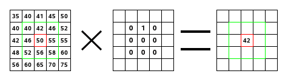
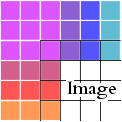

# <u>L1. Functions</u>

- Review of Functions 
- Functions as First-Class Objects
- Closures

What tools do we have for combining simple ideas into more complex ideas?

- Primitives: +, *, ==, !=, . . .
- Means of Combination: if, while, f(g(x)), . . .
- Means of Abstraction: def

## Functions in Environment Model

### Function definition with def:

1. Creates a new function object in memory. In our simplified model, this object contains: 
   - The names of the formal parameters of the function 
   - The code in the body of the function 
   - A reference to the frame in which we were running when this object was created. 
2. Associates that function object with a name 

Note that *the body of the function* is not evaluated at definition time!

### Function application (”calling” or ”invoking”, with round brackets):

1. Evaluate the function to be called, followed by its arguments (in order) 
2. Create a new frame for the function call, with a parent frame determined by the function we’re calling 
3. Bind the parameters of the function to the given arguments in this new frame 
4. Execute the body of the function in this new frame

## Functions are First-class Objects

Like most (but not all) modern programming languages, functions in Python are first-class objects, meaning that they are treated precisely the same way as other primitive types we’ve seen. Among other things, functions: 

- can be the subject of assignment statements 
- can be included in collections (lists, dictionaries, etc) 
- can be the arguments to other functions 
- can be returned as the results of other functions

## Functions within Functions

### Closures

Importantly, a function definition ”remembers” the frame in which it was defined, so that later, when the function is being called, it has access to the variables defined in that ”enclosing” frame. 

We call this combination (of a function and its enclosing frame) a **closure**, and it turns out to be a really useful structure.

e.g.

```python
def add_n(n):
	def inner(x):
		return x + n
	return inner

add1 = add_n(1)
add2 = add_n(2)

print(add2(3))
print(add1(7))
print(add_n(8)(9))
```

## *Thinking*

Lecture1 主要讨论了函数：函数的定义和调用与环境的关系，函数作为一级对象因此和其他原始类型（如数据类型）享有共同的使用方式，函数和其被定义时所处框架间的结合，即闭包（closure）。

# <u>R1. Testing and Debugging Programs</u>

## backwards Revisited

```python
def backwards(sound):
	new_sound = sound.copy() # Line 1
	new_sound['left'].reverse() # Line 2
	new_sound['right'].reverse() # Line 3
	return new_sound # Line 4
```

### it pays to write your own small tests!

```python
def test_backwards():
    input1 = {'rate': 10,
              'left': [1, 2],
              'right': [3, 4]}
    output1 = {'rate': 10,
               'left': [2, 1],
               'right': [4, 3]}
    assert backwards(input1) == output1
    assert backwards(backwards(input1)) == input1
    assert backwards(output1) == input1
    # ^-- new test here!
    
    input2 = {'rate': 10,
              'left': [1, 2, 8],
              'right': [3, 4, 9]}
    output2 = {'rate': 10,
               'left': [8, 2, 1],
               'right': [9, 4, 3]}
    assert backwards(input2) == output2
```

### Let's add some debug printing to our backwards function

```python
def backwards(sound):
    print('backwards input', sound)
    new_sound = sound
    new_sound['left'].reverse()
    print('after first reverse: sound', sound, 'new_sound', new_sound)
    new_sound['right'].reverse()
    print('after second reverse: sound', sound, 'new_sound', new_sound)
    return new_sound
```

We are *modifying the input of the function*, not just generating an output! Aliasing strikes again.

We still also need to *make a copy of the dictionary*!

```python
def backwards(sound):
    new_sound = sound.copy()
    new_sound['left'] = new_sound['left'][::-1]
    # ^-- note fancy notation for making a reversed copy of a list!
    new_sound['right'] = new_sound['right'][::-1]
    return new_sound
```

### Recipe

1. Think of all the tricky cases a function must be ready to handle. Start adding tests that will eventually cover all the tricky cases. It usually makes sense to develop the tests in increasing order of complexity. Save them all in a simple function that you can call on your code over and over again as you develop it.

2. When you find a failing test, think about what you know and don't know for sure, in the execution of the function you're debugging.

### Alternative Codes

```python
def backwards(sound):
    new_sound = sound.copy()
    new_sound['left'] = new_sound['left'][::-1]
    new_sound['right'] = new_sound['right'][::-1]
    return new_sound

def backwards(sound):
    return {
        'rate': sound['rate'],
        'left': sound['left'][::-1],
        'right': sound['right'][::-1],
    }

def backwards(sound):
    return {k: (v if k == 'rate' else v[::-1]) for k,v in sound.items()}
```

## Example 2 : Summing Lists

```python
def sum_lists(lists):
    """Given a list of lists,
    return a new list where each list is replaced by
    the sum of its elements."""
    output = [0] * len(lists)
    for i in range(len(lists)):
        print('Iteration', i)
        total = 0
        for value in lists[i]:
            total += value
        print('Trying to write', total, 'to', i)
        output[i] = total
    return output
```

We can take advantage of some interesting Python structures and built-ins in order to write the same thing program much more concisely

```python
def sum_lists(lists):
    return [sum(list_) for list_ in lists]
```

##  Some Examples with Comprehensions

### Defensive

It’s generally much nicer to write the function “defensively” with an extra assertion `assert`, which itself provides documentation value when it fails.

```python
def subtract_lists(l1, l2):
    """Given l1 and l2 same-length lists of numbers,
    return a new list where each position is the difference
    between that position in l1 and in l2."""

    assert len(l1) == len(l2), 'subtract_lists expects two lists of the same length'
    
    output = []
    for i in range(len(l1)):
        output.append(l1[i] - l2[i])
    return output
```

### zip

With `zip`, we can implement this subtraction in one line of code, without mentioning indices within lists.

```python
def subtract_lists(l1, l2):
    assert len(l1) == len(l2)
    return [i1 - i2 for i1, i2 in zip(l1, l2)]
```

### Remove Vocals

```python
def remove_vocals(sound):
    shared_channel = [l - r for l, r in zip(sound['left'], sound['right'])]
    return {
        'rate': sound['rate'],
        'left': shared_channel,
        'right': shared_channel
    }
```

### Matrices

#### multiplication operator for lists

```python
def x_matrix(n):
    """Return a nested list representing an n X n matrix,
    where the locations on diagonals contain 'X'
    and other locations contain spaces ' '."""
    matrix = [[' '] * n] * n   # Line 1 (wrong)
    for i in range(n):         # Line 2
        matrix[i][i] = 'X'     # Line 3
        matrix[i][n-1-i] = 'X' # Line 4
    return matrix              # Line 5
```

In fact, every time we initialize a matrix, every row refers to the same list!

```python
# matrix = [[' '] * n] * n
matrix = [[' '] * n for _ in range(n)]
```

Incidentally, we can do the whole thing with comprehensions.

```python
def x_matrix(n):
    return [['X' if j == i or j == n-1-i else ' '
             for j in range(n)]
            for i in range(n)]
```

### An Echo of `echo`

```python
def repeating_sound(sound, num_repeats, scale):
    """Create a new sound consisting of the original
    plus num_repeats copies of it in order,
    where the first copy has all positions multiplied by scale,
    the second copy has all positions multiplied by scale*2,
    the third by scale*3, etc."""
    def repeating_channel(ch):
        """Do the above for just one of the two channels (left and right),
        passed in directly as a list."""
        print('repeating_channel', ch, 'scale', scale)
        output = ch[:]
        changing_scale = scale
        for i in range(num_repeats):
            output += [n * changing_scale for n in ch]
            changing_scale += scale
            print('output', output, 'scale', changing_scale)
        return output
    
    print('repeating_sound', sound)
    return {'rate': sound['rate'],
            'left': repeating_channel(sound['left']),
            'right': repeating_channel(sound['right'])}
```

### Full  `echo`  Function

```python
def echo(samples, sample_delay, num_echos, scale):
    result_samples = [0] * (len(samples) + sample_delay*num_echos)

    # the various delays after which echoes start
    offsets = [sample_delay*i for i in range(num_echos+1)]
    
    # keep track of exponent for scale
    count = 0

    for i in offsets:
        # Scale appropriately
        scaled_samples = []
        for samp in samples:
            scaled_samples.append(samp * scale**count)
        
        # Insert delay
        scaled_and_offset_samples = [0]*i + scaled_samples

        # Mix
        print('len', range(len(scaled_and_offset_samples)))
        for j in range(len(scaled_and_offset_samples)):
            print('j', j)
            result_samples[j] += scaled_and_offset_samples[j]
        
        count += 1

    return result_samples
```

++ `num_echos` 只是回音的次数，需要加上声源本身的1次（加一减一的重要性）

## *Thinking*

1. Recitation1 主要通过 Lab0 的几个问题讨论了调试程序的方法：
   1. 根据程序要完成的任务设计小测试
   2. 打印程序过程中的结果进行检查
2. 几个常见的错误：
   1. 别名：对于输入的字典进行改变，或是复制了字典，但对于字典内列表的改变
   2. 列表长度的加一减一
3. 通过 `assert` 构建函数对于错误输入的防御性

# <u>Lab1. Image Processing</u>

## Introduction

### Digital Image Representation and Color Encoding

For this lab, we'll represent an image using a Python dictionary with three keys:

- `width`: the width of the image (in pixels),
- `height`: the height of the image (in pixels), and
- `pixels`: a Python list of pixel brightnesses stored in [row-major order](https://en.wikipedia.org/wiki/Row-major_order) (listing the top row left-to-right, then the next row, and so on)

```
i = {'height': 3, 'width': 2, 'pixels': [0, 50, 50, 100, 100, 255]}
```

## Image Filtering via Per-Pixel Transformations

### Adding a Test Case

Throughout the lab, you are welcome to (and may find it useful to) add your own test cases for other parts of the code as you are debugging `lab.py` and any extensions or utility functions you write.

### `lambda` and Higher-order Functions

## Image Filtering via Correlation



In particular, for a $3 \times 3$ kernel $k$, we have:
$$
\begin{aligned}
O_{x, y}=& I_{x-1, y-1} \times k_{0,0}+I_{x, y-1} \times k_{1,0}+I_{x+1, y-1} \times k_{2,0}+\\
& I_{x-1, y} \times k_{0,1}+I_{x, y} \times k_{1,1}+I_{x+1, y} \times k_{2,1}+\\
& I_{x-1, y+1} \times k_{0,2}+I_{x, y+1} \times k_{1,2}+I_{x+1, y+1} \times k_{2,2}
\end{aligned}
$$

### Edge Effects

When implementing correlation, we will consider these out-of-bounds pixels in terms of an *extended* version of the input image.



### Correlation

`correlate` and `round_and_clip_image`

## Blurring and Sharpening

### Box Blur

For a box blur, the kernel is an $n\times n$ square of identical values that sum to 1.

### Sharpening

If we have an image $(I)$ and a blurred version of that same image $(B)$, the value of the sharpened image $S$ at a particular location is:
$$
S_{x, y}=2 I_{x, y}-B_{x, y}
$$

## Edge Detection (Sobel operator)

$K_x$:

```
-1 0 1
-2 0 2
-1 0 1
```

$K_y$:

```
-1 -2 -1
 0  0  0
 1  2  1
```

After computing $O x$ and $O y$ by correlating the input with $K x$ and $K y$ respectively, each pixel of the output $O$ is the square
root of the sum of squares of corresponding pixels in $O x$ and $O y$ :
$$
O_{x, y}=\operatorname{round}\left(\sqrt{O x_{x, y}^{2}+O y_{x, y}^{2}}\right)
$$

## *Thinking*

1. Lab1 开始讨论图像处理的问题。首先是图像的表示方式。然后是图像的逐像素处理和通过核矩阵（kernel）的相关处理（correlation）。
2. 核矩阵通过将一个像素周边像素的信息纳入到该像素中，创造了丰富的结果：模糊、锐化、描边。
3. Lab1 的程序的结构
   1. Helper Functions （在主体中被重复使用）
   2. Functional Functions （主体部分）
   3. `if __name__ == '__main__':` （作为测试的框架，在pytest中不被调用）


