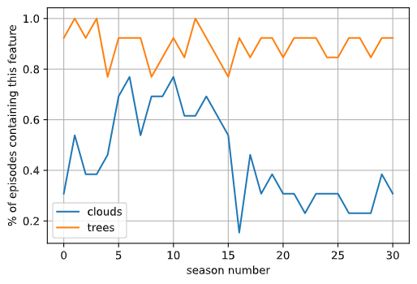

# <u>R11. Working with Text Files</u>

## csv

```python
painting_features = {}
with open('data/features.csv') as f:
    # below: .strip() removes whitespace (spaces, tabs, newlines) from the
    # start and the end of a string; .lower() converts to lowercase (bob ross
    # wouldn't yell!), and .split(',') gives us a list of substrings that were
    # separated by commas in the original string.
    # all told, this gives us a list containing the headers (names of the
    # columns), one after the other
    headers = f.readline().strip().lower().split(',')
    for line in f:
        # each line (after the first) represents one episode, with an ID,
        # followed by some number of True/False values, one corresponding to
        # each possible feature in the associated painting

        # separate this line into a list, like we did above (note .strip() to
        # remove the trailing \n)
        vals = line.strip().split(',')

        # there are many different ways we could do the following piece, but we
        # would like to construct a set containing the names of the features
        # present in this episode.  we'll use a happy little set comprehension:
        this_features = {header for header, val in zip(headers, vals) if val == 'True'}
        # note a potential bug here: "if val" on its own would not have worked;
        # why?

        # now, let's associate this set of features with this episode's ID in
        # the dictionary
        painting_features[vals[0]] = this_features
```

## jason

```python
import json

with open('data/episodes.json') as f:
    episodes = json.load(f)
```

## txt

```python
non_bob_eps = set()
with open('data/guest_host_episodes.txt') as f:
    for line in f:
        non_bob_eps.add((int(line[1:3]), int(line[4:6])))
```

## matplotlib

```python
import matplotlib.pyplot as plt

plt.plot(clouds_by_season, label='clouds')
plt.plot(tree_by_season, label='trees')
plt.legend()
plt.grid()
plt.xlabel('season number')
plt.ylabel('% of episodes containing this feature')
plt.show()
```




