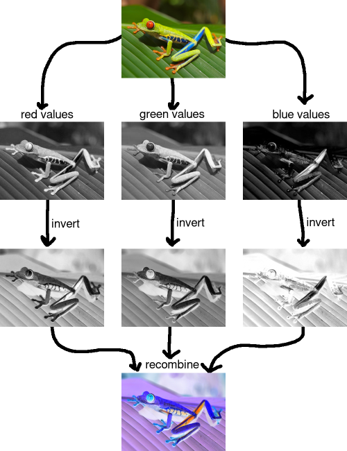

# <u>R2. Set and Dictionary</u>

## Sets

A set is an unordered collection with no duplicate elements. Basic uses include membership testing and eliminating duplicate entries. Set objects also support mathematical operations like union, intersection, difference, and symmetric difference. Sets can also have important efficiency benefits.

### One Motivation -- Lists can be slooooooow....

several important operations (adding an element, determining whether an element is in the set) take ***constant time*** regardless of the size of the set, rather than ***linear time*** in the size of the list.

```python
big_num = 10000000 # ten million
big_num_list = list(range(big_num)) 
big_num_set = set(big_num_list)

small_num = 100
small_num_list = list(range(big_num - small_num, big_num))
small_num_set = set(small_num_list)

count = 0
for i in small_num_list:
    count += 1 if i in big_num_list else 0 # time: 12.209 sec

count = 0
for i in small_num_list:
    count += 1 if i in big_num_set else 0 # time: 0.012 sec
    
count_intersection = len(big_num_set.intersection(small_num_set)) # time: 0.004 sec
```

### Another Motivation -- Conceptual clarity with set operations

```python
# Lists can have duplicate elements, and lists are ordered
basket = ['apple', 'orange', 'apple', 'pear', 'orange']

# Creating a set from a list results in a set without duplicate elements
fruit1 = set(basket)
print(fruit1)
```

```python
# Can discard/remove elements
fruit1.discard('grape')  #no exception if element not in set
fruit1.remove('apple') #exception if element not in set
print(fruit1)
```

### Basic set operations

```python
#Intersection
print("Intersection:", fruit1 & fruit2)

#Union
print("Union:", fruit1 | fruit2)

#Difference
print("Difference, fruit1 - fruit2:", fruit1 - fruit2)
print("Difference, fruit2 - fruit1:", fruit2 - fruit1)

#Symmetric Difference (all elts not in both)
print("Symmetric Difference:", fruit1 ^ fruit2)
```

### Some set relations

```python
#Subset
fruit3.issubset(fruit1)

#Disjoint
fruit3.isdisjoint(fruit2)

#Superset
fruit1.issuperset(fruit3)
```

### What kind of objects can be in a set?

The elements of sets must be **immutable hashable objects**. Thus numbers, strings, tuples (as long as all elements of the tuple are also immutable/hashable objects) can be members of sets, but lists cannot be members of sets. And sets cannot be members of sets!

### Practice

Write a function `duplicate_view` that, given a list of integers `data`, creates and returns a new list `out` of boolean values such that `out[i] = True` if `data[i]` appears at least one additional time in data, before index i.

```python
def duplicate_view(data):
    exist = set()
    out = []
    for i in data:
        if i in exist: out.append(True)
        else: out.append(False)
        exist.add(i)
    return out
```

## Dictionary

As in sets, the keys in dictionaries must be immutable and hashable objects. However, the values associated with the key can be anything, and can be mutable.

```python
table = {} #Create empty dictionary
table[27] = 'my value' #add a key and a value
table["dog"] = [1, 2, "three"]
print("table:", table)
```

```
table: {27: 'my value', 'dog': [1, 2, 'three']}
```

```python
# Iterate over items in a dictionary
for key, val in table.items():
    print("key:", key, "-- val:", val)
```

```python
# Remove element from a dictionary
del table[27]  #Exception if key is not in dictionary
print("table:", table)
```

```python
# Dictionary comprehensions also possible
print ({n: n**3 for n in range(8)})
{n: 'x'*n for n in range(8)}
```

### `get` and `setdefault`

The `get` method enables one to return a default value if the key is not in the dictionary.
`setdefault` is a useful method for dictionaries that saves a lot of initialization code:
`d.setdefault(key, val)` is equivalent to:
`if key not in d: d[key] = val d[key]`

```
table = {}
val = table.get(32, [])
print(val)
print(table) # get doesn't add the item to the dictionary
```

```
table = {}
table.setdefault(32, []).append(1)
print(table[32])
print(table) # setdefault adds the item to the dictionary
```

### Practice

```python
def remove_first_duplicate(data):
    seen = {}
    for i in range(len(data)):
        if data[i] in seen:
            pos = seen[data[i]]
            return data[:pos] + data[pos+1:]
        else:
            seen[data[i]] = i
    return data
```

## Wordplay

### the frequencies of the words

```python
def get_freq(words):
    word_count = {}
    for word in words:
        word_count[word] = word_count.setdefault(word, 0) + 1 # set default is handy to add new keys
    return word_count
```

### the frequencies of *pairs* of *consecutive words*

```python
def get_pair_freq(words):
    word_pair = {}
    for word1, word2 in zip(words, words[1:]): # zip is very handy for jointly processing the i_th element from multiple lists
        word_pair[(word1, word2)] = word_pair.setdefault((word1, word2), 0) + 1
    return word_pair
```

### what (set of) words follow each word

```python
# More pythonic:
word_after = {}
for w1, w2 in zip(words, words[1:]):
    word_after.setdefault(w1, set()).add(w2) # set can use add() while int cannot
```

### identify the high frequency words

```python
def sort_freq_dict(freq):
    return sorted([(value, key) for key, value in freq.items()], reverse=True) # using a list of tuples to sort the dictionary
print(sort_freq_dict(get_freq(words)))
```

### `freq_norm`

```python
def freq_norm(freq):
    return sum(i**2 for i in freq.values())**0.5
```

### `freq_dot`

```python
def freq_dot(freq1, freq2):
    return sum(freq1[w] * freq2[w] for w in set(freq1) & set(freq2))
```

## *Thinking*

Recitation2 主要介绍了set和dictionary这两种数据类型，由于其特性从而有一些特别的用法。正如戴着镣铐的舞蹈，规则下的游戏。（由此也进一步探讨了使用comprehension来简化代码）


# <u>Lab2. Image Processing, Part 2</u>

## Representing Color

RGB color model

- `pixels`: a Python list of pixel values, each represented as a tuple of three integers, `(r, g, b)`, where `r`, `g`, and `b` are all in the range $[0, 255]$. As with last week's lab, these values are stored in [row-major order](https://en.wikipedia.org/wiki/Row-major_order).

## Filters on Color Images

 `color_filter_from_greyscale_filter` 



### Closure

Other Kinds of Filters with Parameter of Kernel Dimension

Cascade of Filters

## Seam Carving

- `greyscale_image_from_color_image(image)`: given a color image, return a greyscale image according to the formula above.
- `compute_energy(grey)`: given a greyscale image resulting from the step above, compute the energy map (using your `edges` function from last lab).
- `cumulative_energy_map(energy)`: given an energy map resulting from the above step, return the "cumulative energy map" as described above.
- `minimum_energy_seam(cem)`: given a "cumulative energy map," return a list of the indices into `im['pixels']` associated with the seam that should be removed
- `image_without_seam(image, seam)`: given an image and a list of indices, return a new image with the associated pixels removed.

## *Thinking*

1. Lab2讨论了彩色图像的处理。由于通常使用RGB的表示模式，可以将灰色图像的函数分别应用在彩色图像的三个通道上。
2. 在此基础上，编写了一个较为复杂的程序——接缝裁切。通过描边算法决定图像的能量图，由此计算每个像素点至顶部的累积能量图，从而确定能量值最小的缝。
3. 接缝裁切的代码由于边缘问题变得比较复杂，实际上或许应该将解决这个问题的函数单独定义。
4. 在写代码之前还是尽量用自然语言/伪代码描述一下想法，不要因为看起来简单就不描述清楚。没办法描述清楚可能正是逻辑上需要更为清晰或者结构需要调整的地方。


